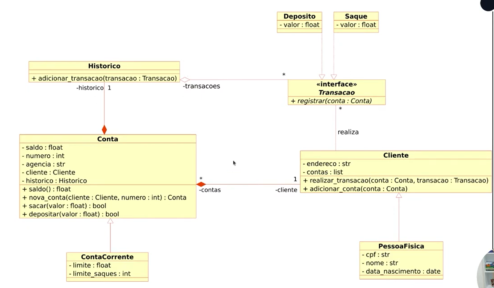

# Bootcamp DIO - Python AI Backend Developer
21/06/2024

## Desafio DIO

Atualizar a implementação do sistema bancário, para armazenar os dados de clientes e contas bancárias em objetos ao invés de dicionários. o Código deve seguir o modelo de Classes UML a seguir:

## Desafio Extra

Após concluir a modelagem das classes e a criação dos métodos. Atualizar os métodos que tratam as opções do Menu para funcionárem com as classes modeladas
